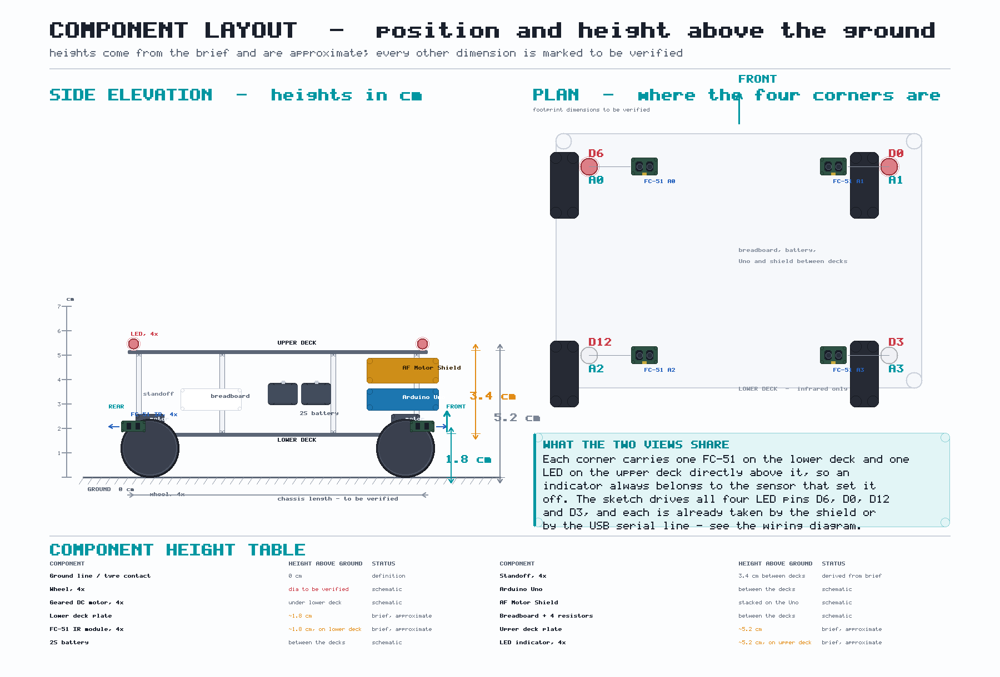
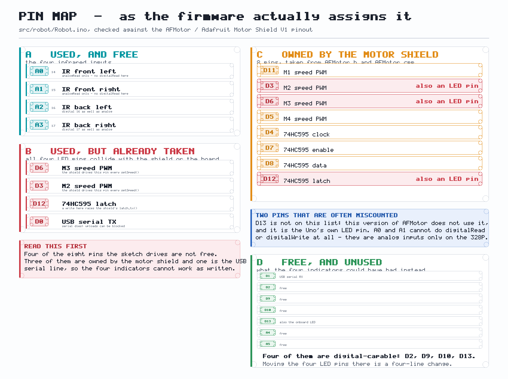
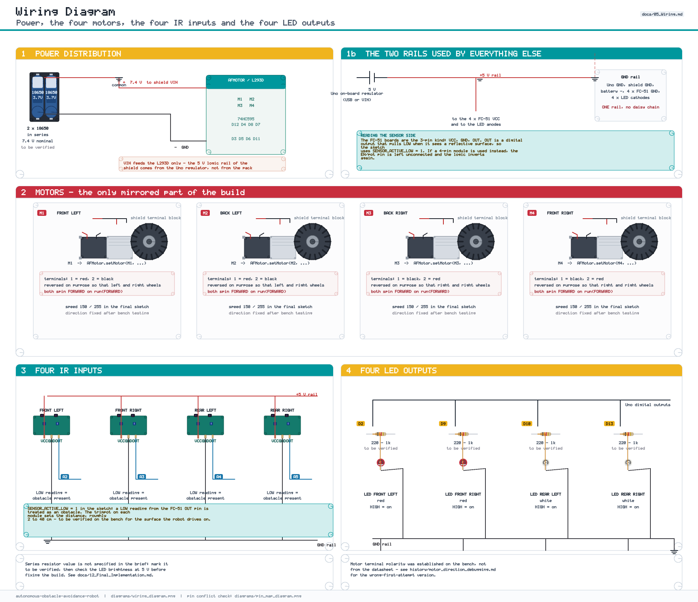
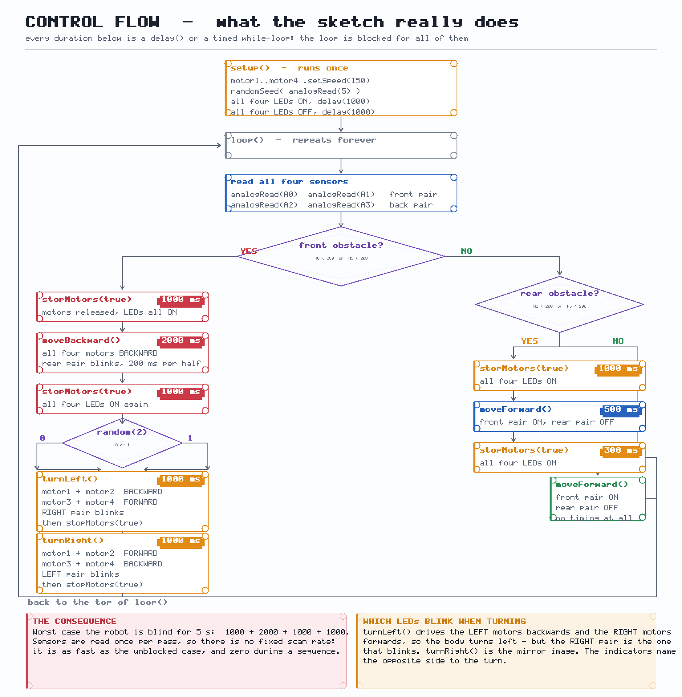

# Autonomous Obstacle-Avoidance Robot

A four-wheel Arduino robot that drives itself around a room and reacts to
obstacles, documented end to end: the hardware, every wire, the firmware as it
is actually written, the tests to run, and the faults that are known to be in it.


The documentation matches the code. Where the code has a problem — and it has
several, all of them named below — the documentation says so instead of
describing what the code should have done.

---

## What it does

| Situation | What the robot does |
|---|---|
| Power-up | 2 s: all four indicators on for 1 s, off for 1 s |
| Clear path | drives forward, front indicators on, rear off |
| Obstacle in front | all indicators on, 1 s → reverse 2 s (rear pair blinks) → all on, 1 s → random turn 1 s → resume |
| Obstacle behind | all indicators on, 1 s → drive **forward** 0.5 s → all on, 0.3 s → resume |
| Turn direction | left or right, chosen at random **once**, when the turn starts |

## The robot




| | |
|---|---|
| Controller | Arduino Uno (ATmega328P) |
| Motor driver | L293D / Adafruit Motor Shield V1, driven by `AFMotor` |
| Motors | 4 × DC geared motors, `setSpeed(150)`, never changed |
| Sensors | 4 × FC-51 IR module, read with `analogRead()` |
| Indicators | 4 × LED — 2 red at the front, 2 white at the rear |
| Power | 2 × 18650 in series, 7.4 V nominal to `VIN` |

**Motors:** `motor1` M1 front-left, `motor2` M2 back-left, `motor3` M3
back-right, `motor4` M4 front-right. The left/right pair is a **wiring mirror**
— the right-hand motors have their terminals swapped — so the code contains no
per-motor inversion.

**Sensors:** `A0` front-left, `A1` front-right, `A2` back-left, `A3`
back-right. An obstacle is `analogRead() < 200`; because the FC-51 output is a
comparator level, that threshold only has to sit between the two digital levels.

## Two things to know before you wire it up

**1. Three of the four indicator pins are not free.**

| Sketch pin | Assigned to | Already used by |
|---|---|---|
| `D6` | front-left LED | M3 speed PWM |
| `D3` | back-right LED | M2 speed PWM |
| `D12` | back-left LED | 74HC595 latch |
| `D0` | front-right LED | USB serial TX |

The shield owns `D3, D4, D5, D6, D7, D8, D11, D12`, and `D0`/`D1` are the USB
serial lines. Writing to `D6` or `D3` fights the shield's speed PWM; writing to
`D12` races the shift-register latch; `pinMode(0, OUTPUT)` takes the serial port
away from the board. The four sensor pins (`A0`–`A3`) are clear.

Four free LED-capable pins exist — `D2`, `D9`, `D10`, `D13` — so this is a
four-line change, not a redesign. Full analysis and the verification method:
**[12 — Final Implementation §7](docs/12_Final_Implementation.md#7-pin-conflict--verification)**.



**2. The loop blocks.** The sketch uses `millis()` for the two timed
`while` loops, but it also uses `delay()` ten times. The longest stretch in
which no sensor is read is **5000 ms** — the whole front-obstacle sequence. The
indicators keep blinking during a manoeuvre; the sensors do not.

## Wiring

```text
             +---------------------+
  FC-51 x4   |     Arduino Uno     |   LEDs x4
  A0 A1 A2 A3|                     |   D6 D0 D12 D3
  ---------->|                     |--------------> 2 red front
  GND        |   AF Motor Shield   |                 2 white rear
  5V         |   (L293D + 74HC595) |
  <----------|  M1 M2 M3 M4       |----> 4 DC geared motors
             +---------------------+
                        ^
                        |
             2 x 18650 in series (7.4 V nominal)
```



Motor current goes from the pack straight into the shield's `VIN` and never
passes through the Uno's 5 V regulator; the regulator feeds only the sensors and
the indicators. All grounds are one rail.

## The firmware

[`src/robot/Robot.ino`](src/robot/Robot.ino) — one file, 159 lines, no classes.

```text
setup()  speeds 150, seed the RNG, 1 s all-on, 1 s all-off

loop()   read A0 A1 A2 A3
         |
         +-- front blocked  --> stop 1s, reverse 2s, stop 1s, random turn 1s
         +-- rear  blocked  --> stop 1s, forward 0.5s, stop 0.3s
         +-- clear          --> forward
```

* three cases, two comparisons against a literal `200`
* `moveBackward()` and the two turn functions are timed `while` loops paced by
  `delay(10)`; the blink runs inside them
* everything else waits with a bare `delay()`
* `stopMotors(bool allLedsOn = false)` releases the motors and sets all four
  indicators to one state or the other



## Build it

Hardware: **[06 — Mechanical Construction](docs/06_Mechanical_Construction.md)**
Wiring: **[05 — Wiring](docs/05_Wiring.md)** · Safety checklist:
**[12 §11](docs/12_Final_Implementation.md#11-safety-checklist-before-powering)**

Firmware — **Arduino IDE 1.8.19**:

1. **Sketch → Include Library → Manage Libraries…** → install **Adafruit Motor
   Shield Library** (provides `AFMotor.h`; not bundled with the IDE).
2. **File → Open…** → `src/robot/Robot.ino`.
3. **Tools → Board → Arduino Uno**, **Tools → Port** → your board.
4. **Verify** (✓), then **Upload** (→).

More, including the common upload error, in
**[12 §9](docs/12_Final_Implementation.md#9-compile-and-upload--arduino-ide-1819)**.

## Test it

Work up to it in stages: one motor at a time, on blocks, before the robot
touches the floor. Order and expected readings in
**[09 — Testing](docs/09_Testing.md)**; when something misbehaves, start at
**[10 — Troubleshooting](docs/10_Troubleshooting.md)**.

## Documentation

### The design

| Document | Contents |
|---|---|
| [01 — Project Overview](docs/01_Project_Overview.md) | what it is and where to start |
| [02 — Requirements](docs/02_Requirements.md) | requirements, and the constraints that broke them |
| [03 — Hardware](docs/03_Hardware.md) | every component, and the *to be verified* list |
| [04 — Electrical Architecture](docs/04_Electrical_Architecture.md) | the two power domains, the 5 V rail, the pin header |
| [05 — Wiring](docs/05_Wiring.md) | every connection, the motor mirror, the four conflicts |
| [06 — Mechanical Construction](docs/06_Mechanical_Construction.md) | the build steps |
| [07 — Software Architecture](docs/07_Software_Architecture.md) | every function, and what is wrong with it |
| [08 — Algorithm](docs/08_Algorithm.md) | the three cases, in order, with every duration |
| [09 — Testing](docs/09_Testing.md) | the bench procedure, and what was not measured |
| [10 — Troubleshooting](docs/10_Troubleshooting.md) | faults, causes, fixes |
| [11 — Power System](docs/11_Power_System.md) | the "6800 mAh" problem, brown-outs, cell safety |
| **[12 — Final Implementation](docs/12_Final_Implementation.md)** | **the normative document** |
| [13 — Future Improvements](docs/13_Future_Improvements.md) | the ordered list of fixes |

### How it got here

Historical documents record approaches and what replaced them. They are not
specifications — where they disagree with document 12, document 12 is right.

| Stage | What happened |
|---|---|
| [Initial concept](history/initial_concept.md) | the first idea, and the first sketch |
| [Analog sensor experiment](history/analog_sensor_experiment.md) | reading an FC-51 as a digital level |
| [Motor testing](history/motor_testing.md) | the robot twisted on the spot, and the mirror fix |
| [Power testing](history/power_testing.md) | the "6800 mAh" cells, and the brown-out that looked like a bug |
| [Final changes](history/final_changes.md) | the sketch that is in the repository now, and what it replaced |

## Diagrams and images

| File | Shows |
|---|---|
| `diagrams/system_block_diagram.png` | the subsystems and their interfaces |
| `diagrams/algorithm_flowchart.png` | the control flow, with every blocking duration |
| `diagrams/robot_top_view.png` | sensor and indicator positions, with the real pin labels |
| `diagrams/robot_component_layout.png` | where every component sits, and its height above the ground in cm |
| `diagrams/robot_side_view.png` | the two deck heights |
| `diagrams/robot_front_view.png` | front and rear indicator layout |
| `diagrams/wiring_diagram.png` | the complete wiring, conflicts marked |
| `diagrams/pin_map_diagram.png` | the shield's eight pins against the four this sketch drives |
| `diagrams/robot_final_concept.png` | the machine, seen from the side |
| `images/robot_overview.png` | the whole robot, isometric |
| `images/hardware_setup.png` | the Uno, the shield and the battery |
| `images/chassis_assembly.png` | the two-level chassis |
| `images/testing.png` | the bench test sequence |

## Known limits

Stated here so nothing is discovered the hard way:

* **Three indicator pins and one serial pin are double-booked.** The four
  indicators cannot work as wired; see the top of this file.
* **The robot is blind for up to 5 s** during a front-obstacle sequence.
* **The turn indicators are on the wrong side** — `turnLeft()` blinks the
  right-hand pair.
* **No sensor polarity switch.** A module that pulls `OUT` high while blocked
  will never trigger.
* **No hysteresis.** One marginal sample starts a 5 s sequence.
* **The 2 s startup signal is a signal, not a safety delay.** The robot moves
  as soon as it ends.
* **No runtime, current or capacity figures** — none were measured.
* **The "6800 mAh" label was not trusted**, and the cells that carried it
  under-performed; see
  [11 §2](docs/11_Power_System.md#2-the-6800-mah-problem).
* **The turn is timed, not measured** — `1000 ms` covers a different angle on a
  different floor.
* **The robot drifts.** No encoders, so equal PWM is assumed to mean equal speed.

## License

MIT — see [LICENSE](LICENSE).
