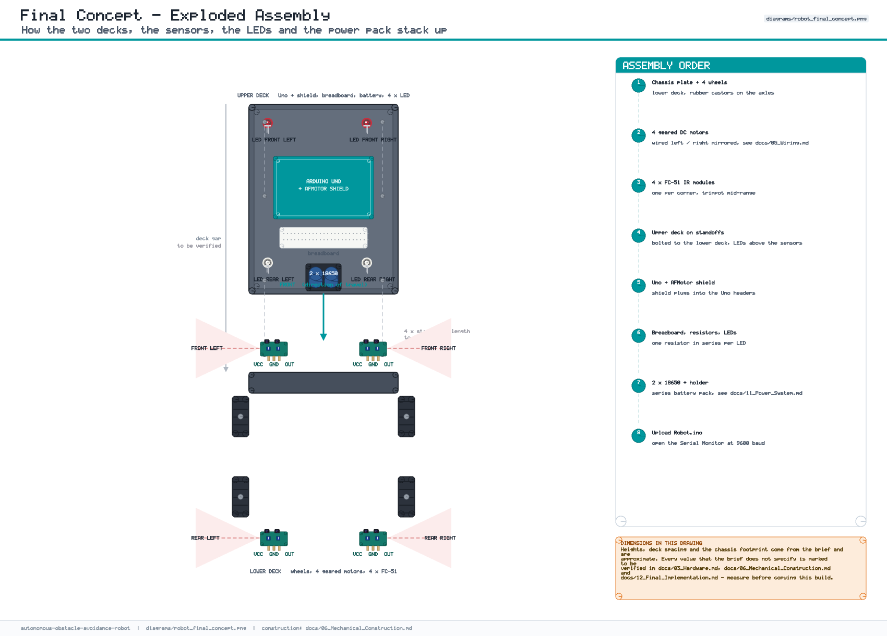
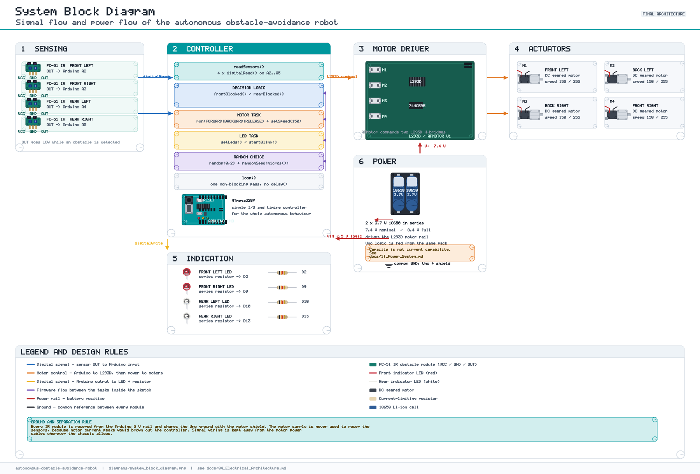

# 01 — Project Overview

**Project:** Autonomous Obstacle-Avoidance Robot
**Platform:** Arduino Uno (ATmega328P) + L293D / Adafruit Motor Shield V1-compatible shield
**Firmware:** [`src/robot/Robot.ino`](../src/robot/Robot.ino)
**Status:** final implementation documented, with the full development history kept in [`history/`](../history/)
**Read this first:** the firmware drives three indicator pins that the motor
shield already owns, and blocks the sensor scan for up to 5 s at a time. Both are
documented rather than hidden — see [12 §7](12_Final_Implementation.md#7-pin-conflict--verification)
and [07 §5](07_Software_Architecture.md#5-why-that-matters-here).

---

## 1. What the robot does

The robot is an autonomous mobile platform. It drives forward on its own, watches
the space in front of and behind it with four infrared sensors, and reacts:

| Situation | Reaction |
|---|---|
| Clear ahead | Drive forward. Front LEDs steady, rear LEDs off. |
| Obstacle in front | Stop with all four LEDs on, 1 s → reverse for 2 s while the rear LEDs blink → stop again, 1 s → pick a turn direction at random and turn for 1 s → resume forward. |
| Obstacle behind | Stop, 1 s → drive forward 0.5 s → stop, 0.3 s → resume normal forward. |
| Power-on | 2 s: all four LEDs on for 1 s, then off for 1 s. The robot moves the instant the second second ends. |

The three cases are three `if` branches in `loop()`. Two of them run on
`millis()` deadlines; the rest of the sketch uses `delay()` — **ten
times** — so the robot is blind for up to **5000 ms** during a front-obstacle
sequence. That contradicts the brief's non-blocking requirement, and the
sequence is reported as it is rather than as it should be — see
[08 — Algorithm](08_Algorithm.md) and
[02 §4 N1](02_Requirements.md#4-non-functional-requirements).


## 2. Why the robot is built in two levels

The chassis has a lower level and an upper level:

* **Lower level (~1.8 cm from the ground):** the four FC-51 IR obstacle sensors.
* **Upper level (~5.2 cm from the ground):** the four directional indicator LEDs
  (2 red at the front, 2 white at the rear), each one directly above the sensor
  below it.

The intent of the arrangement is to improve the detection of obstacles of
different heights and to keep the status indication visible while the robot is
reversing. The heights above are the approximate values from the project brief.

> **Heights given by the brief:** lower sensor level ≈ 1.8 cm, upper level ≈ 5.2 cm.
> **To be verified:** chassis length and width, deck spacing, wheel diameter,
> standoff length, resistor value, battery capacity. Nothing else was specified.



## 3. System blocks



| Block | Component | Notes |
|---|---|---|
| Controller | Arduino Uno | ATmega328P, 14 digital + 6 analog-capable pins |
| Motor driver | L293D / AFMotor shield V1 | 4 channels M1–M4, uses 8 Arduino pins |
| Actuators | 4 DC geared motors | `setSpeed(150)`, set once in `setup()` and never changed |
| Sensors | 4 × FC-51 IR module | comparator OUT read with `analogRead()`, one per chassis corner, on `A0`–`A3` |
| Indicators | 4 × 5 mm LED + resistor | 2 red front, 2 white rear — **all four pins conflict with the shield** |
| Power | 2 × 3.7 V 18650 in series | 7.4 V motor rail, capacity to be verified |

## 4. How the repository is organised

```
/README.md                     project front page, badges, hero image
/LICENSE                       MIT
/src/robot/Robot.ino           the final firmware
/docs/01..13                   the engineering documentation
/diagrams/                     original engineering drawings
/images/                       original illustrations
/history/                      what was tried first, and why it changed
```

| Document | Content |
|---|---|
| [01 Project Overview](01_Project_Overview.md) | this page |
| [02 Requirements](02_Requirements.md) | what the robot must and must not do |
| [03 Hardware](03_Hardware.md) | components, heights, and what is *to be verified* |
| [04 Electrical Architecture](04_Electrical_Architecture.md) | rails, shields, signal levels, grounding |
| [05 Wiring](05_Wiring.md) | every connection, with the pin map |
| [06 Mechanical Construction](06_Mechanical_Construction.md) | the 14 build steps, in order |
| [07 Software Architecture](07_Software_Architecture.md) | functions, variables, programming techniques |
| [08 Algorithm](08_Algorithm.md) | pseudocode, states, timings |
| [09 Testing](09_Testing.md) | bench protocol and results |
| [10 Troubleshooting](10_Troubleshooting.md) | Problem → Cause → Test → Observation → Fix → Lesson |
| [11 Power System](11_Power_System.md) | voltage vs current vs capacity vs startup current |
| [12 Final Implementation](12_Final_Implementation.md) | **the definitive hardware, wiring, code and pin-conflict check** |
| [13 Future Improvements](13_Future_Improvements.md) | the faults to fix first, then what was deliberately left out |

## 5. Reading rules for this documentation

1. **Final vs. history.** Anything under [`history/`](../history/) describes an
   approach that was tried and then changed. It is *not* part of the final
   design. The final design is documented in
   [12 — Final Implementation](12_Final_Implementation.md).
2. **"To be verified"** means the project brief did not specify the value. It is
   never a guessed number presented as fact.
3. **The code is the reference.** Every pin, timing and behaviour claimed in the
   documentation can be checked in [`src/robot/Robot.ino`](../src/robot/Robot.ino).
   Where the code is at fault, the documentation says so: the four indicator
   pins, the 5 s blind period, the turn indicators on the wrong side, the two
   unnamed thresholds. Nothing has been "fixed" in the firmware, because the
   firmware is published as supplied.

## 6. Next

* Start with [02 Requirements](02_Requirements.md) to see what the design has to satisfy.
* If you want to build it, go to [03 Hardware](03_Hardware.md) →
  [06 Mechanical Construction](06_Mechanical_Construction.md) →
  [05 Wiring](05_Wiring.md) → [12 Final Implementation](12_Final_Implementation.md).
