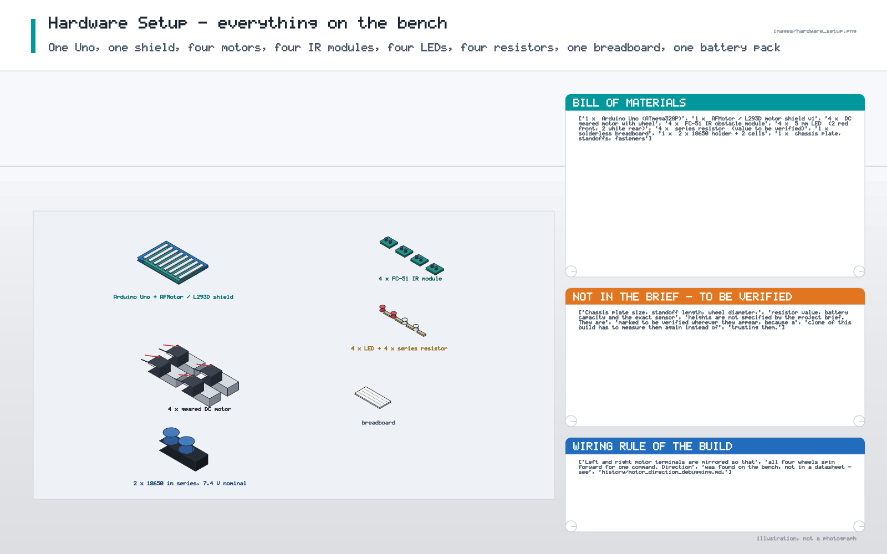
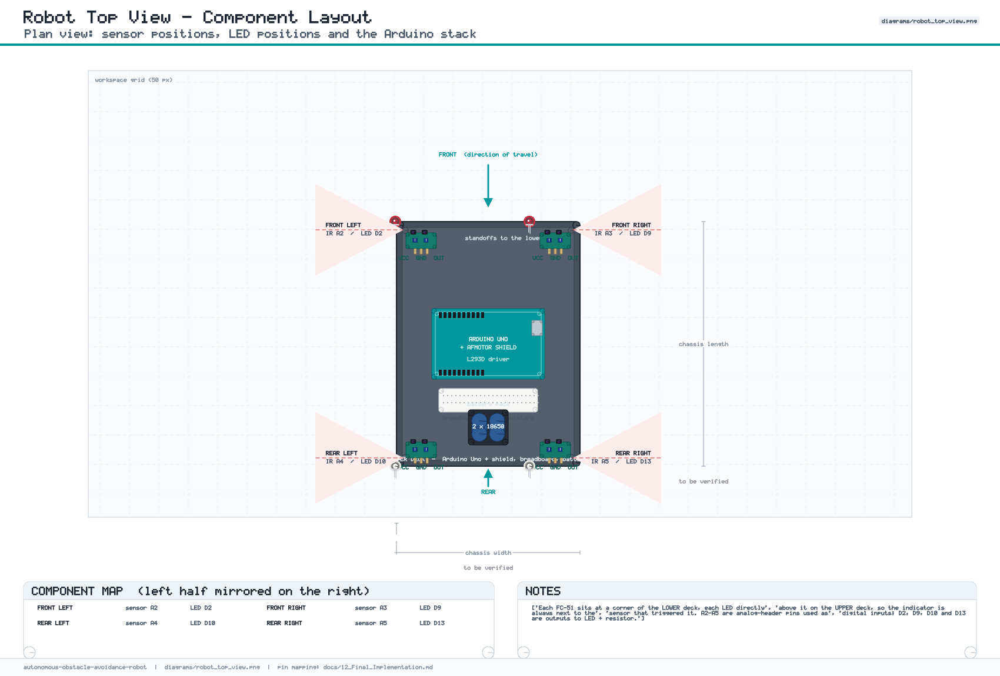
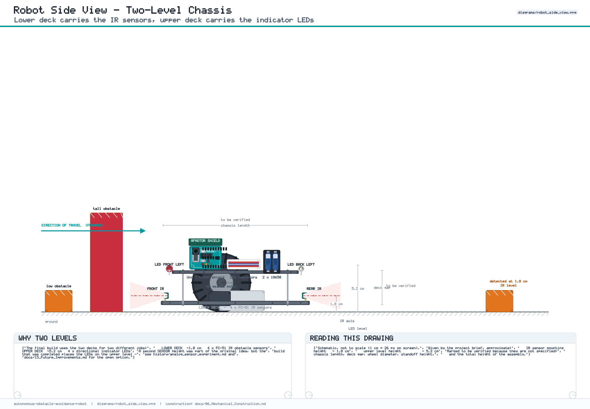
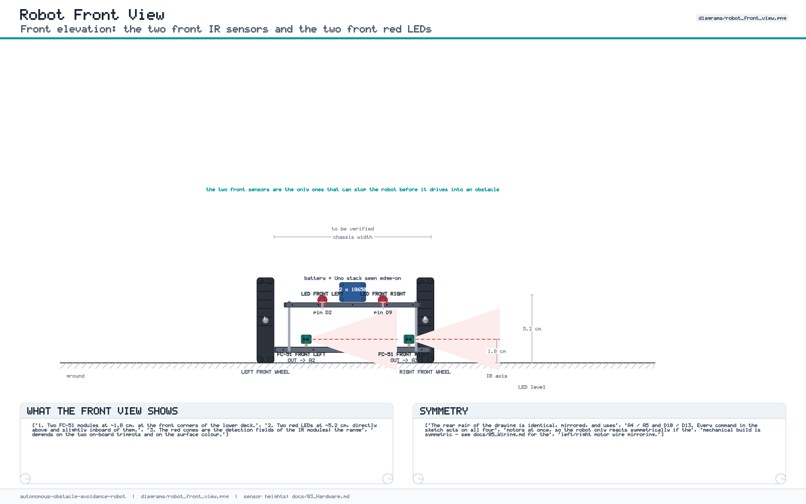

# 03 — Hardware

The bill of materials of the **final** build, the physical arrangement, and an
explicit list of everything the project brief does *not* fix.

---

## 1. Bill of materials

| # | Item | Qty | Notes |
|---|---|---|---|
| 1 | Arduino Uno (ATmega328P) | 1 | main controller |
| 2 | L293D / Adafruit Motor Shield V1-compatible shield | 1 | plugs into the Uno headers; uses `AFMotor` |
| 3 | DC geared motor | 4 | channels M1–M4 |
| 4 | Wheel / caster for the motor shaft | 4 | diameter **to be verified** |
| 5 | FC-51 IR obstacle module (LM393, 3-pin) | 4 | digital `OUT`, on-board trimpot |
| 6 | 5 mm LED, red | 2 | front indicators |
| 7 | 5 mm LED, white | 2 | rear indicators |
| 8 | Current-limiting resistor | 4 | value **to be verified** |
| 9 | Solderless breadboard | 1 | LED + resistor wiring |
| 10 | 18650 Li-ion cell, 3.7 V | 2 | series pair, **7.4 V nominal** |
| 11 | 2-cell 18650 holder + leads | 1 | capacity of the cells **to be verified** |
| 12 | Chassis plate (lower + upper level) | 2 | dimensions **to be verified** |
| 13 | Standoffs, bolts, nuts | set | length **to be verified** |
| 14 | Jumper wires, heat-shrink | set | |

> The brief specifies component *types*, not models. Anything that would pin the
> design to a single vendor part is therefore left open on purpose.

## 2. Controller

**Arduino Uno**, ATmega328P at 16 MHz, 32 KB flash, 2 KB SRAM.

Digital I/O actually available on this board: D0–D13 plus A0–A5. D0/D1 are the
USB serial lines and A0/A1 are analog-only on this chip. With the motor shield
fitted, the project uses the pins listed in
[12 Final Implementation §6](12_Final_Implementation.md#6-final-pin-mapping).

## 3. Motor driver shield

The shield is an **L293D** dual H-bridge board driven through a **74HC595**
shift register, and it is controlled with Adafruit's `AFMotor` library.

| Function | Pins the shield owns |
|---|---|
| Speed PWM per channel | D11 (M1), D3 (M2), D6 (M3), D5 (M4) |
| 74HC595 shift register | D12 latch, D4 clock, D8 data, D7 enable |

These eight pins are **not available** for sensors or LEDs. The mapping was
verified against the library source, not assumed — the procedure and the full
table are in [12 Final Implementation §7](12_Final_Implementation.md#7-pin-conflict--verification)
and drawn in [`diagrams/pin_map_diagram.png`](../diagrams/pin_map_diagram.png).

## 4. Motors and channels

| Channel | Position | Sketch object |
|---|---|---|
| M1 | Front left | `AFMotor motorFL(1)` |
| M2 | Back left | `AFMotor motorBL(2)` |
| M3 | Back right | `AFMotor motorBR(3)` |
| M4 | Front right | `AFMotor motorFR(4)` |

Speed in the final firmware: `MOTOR_SPEED = 150` on the 0–255 scale, i.e. about
59 % of full command.

**DC motors have no fixed "VCC" and "GND" terminal.** Each motor has two
terminals and the H-bridge reverses the polarity across them to change
direction. Red and black are used as an *organisational convention only*.
Getting the mirror right on a left/right motor pair is the single most common
construction error in this project — it is explained in
[05 Wiring §4](05_Wiring.md#4-motor-wiring-and-the-leftright-mirror) and in
[history/motor_testing.md](../history/motor_testing.md).

## 5. IR sensors

Four **FC-51** (LM393) obstacle-avoidance modules, one at each corner of the
lower chassis level.

| Sensor | Position | Sketch pin | Physical connector |
|---|---|---|---|
| IR front left | front-left corner | `A2` (digital 16) | OUT |
| IR front right | front-right corner | `A3` (digital 17) | OUT |
| IR rear left | rear-left corner | `A4` (digital 18) | OUT |
| IR rear right | rear-right corner | `A5` (digital 19) | OUT |

* Interface: **VCC / GND / OUT**, driven by `digitalRead()`. The final firmware
  does **not** call `analogRead()` — see
  [07 Software Architecture §6](07_Software_Architecture.md#6-why-the-sensors-are-read-digitally).
* A2–A5 are printed in the ANALOG header of the Uno but they are ordinary GPIO
  pins; the physical header and the software use are two different things.
* `OUT` is **LOW while an obstacle is in range** on a standard module, which is
  what `SENSOR_ACTIVE_LOW = 1` encodes. Confirm on your own board —
  [09 Testing step 4](09_Testing.md#step-4--lowhigh-sensor-logic).
* Detection distance is set by the on-board trimpot: roughly 2–40 cm depending
  on the module and the surface. **To be verified** for the real floor material.

## 6. Indicator LEDs

| LED | Colour | Position | Sketch pin |
|---|---|---|---|
| `LED_FRONT_LEFT` | red | front, above the front-left IR | `D2` |
| `LED_FRONT_RIGHT` | red | front, above the front-right IR | `D9` |
| `LED_REAR_LEFT` | white | rear, above the rear-left IR | `D10` |
| `LED_REAR_RIGHT` | white | rear, above the rear-right IR | `D13` |

Every LED is driven **from an Arduino pin to GND** with a series resistor
between the pin and the LED anode.

* An LED has exactly two terminals: the **anode** (+, the longer leg) and the
  **cathode** (−, the shorter leg, flat side of the body).
* The current-limiting resistor may be placed in series on **either** side of
  the LED — electrically it makes no difference. In this build it is on the
  **pin side**, anode side.
* `D13` is also the Uno's built-in LED pin. Driving it lights the onboard LED as
  well; this is harmless (the onboard LED and its resistor are in parallel with
  the external LED) but the onboard LED will mirror the rear-right indicator.
  See [12 Final Implementation §7](12_Final_Implementation.md#7-pin-conflict--verification).

## 7. Power source

Two 3.7 V 18650 Li-ion cells **in series** → a 7.4 V nominal motor rail feeding
the shield's `VIN` input.

| Property | Value / status |
|---|---|
| Cell nominal voltage | 3.7 V (given by the brief) |
| Arrangement | 2S, 7.4 V nominal (≈ 8.4 V fully charged) **to be verified** with a meter |
| Capacity | **to be verified** — the cells tested did not give satisfactory performance, see [11 Power System](11_Power_System.md) |
| Motor startup / stall current | **to be verified** from the motor datasheet or by measurement |
| Chemistry safety | only use a purpose-made 2× 18650 holder; never solder cells directly; do not charge loose cells on the bench |

AA batteries were tried first — see [history/power_testing.md](../history/power_testing.md).
The reasoning behind the whole power choice is in
[11 Power System](11_Power_System.md).

## 8. Mechanical layout

| Level | Height from the ground | Carries |
|---|---|---|
| Lower | ≈ 1.8 cm | the four IR modules, the four motors and the wheels |
| Upper | ≈ 5.2 cm | the four indicator LEDs, the Uno + shield, the breadboard, the battery |

| Dimension | Status |
|---|---|
| Lower sensor level ≈ 1.8 cm | given by the brief, approximate |
| Upper level ≈ 5.2 cm | given by the brief, approximate |
| Chassis length / width | **to be verified** |
| Deck gap (standoff length) | **to be verified** |
| Wheel diameter | **to be verified** |

## 9. Summary of everything marked "to be verified"

| Item | Where to fix it |
|---|---|
| Sensor level height (1.8 cm) | measure on the build, adjust the sensor brackets |
| Upper level height (5.2 cm) | measure on the build, adjust the standoffs |
| Chassis footprint | measure; it drives the drawing scale only |
| Deck gap | measure; it is the standoff length |
| Wheel diameter | measure; affects ground clearance and speed |
| LED series resistor value | compute for the LED forward voltage and the pin current, then confirm by brightness |
| Battery capacity and cell condition | measure with a load tester, not from the label |
| Motor startup / stall current | measure or take from the motor datasheet |
| Actual measured obstacle range | measure per surface with the trimpot |
