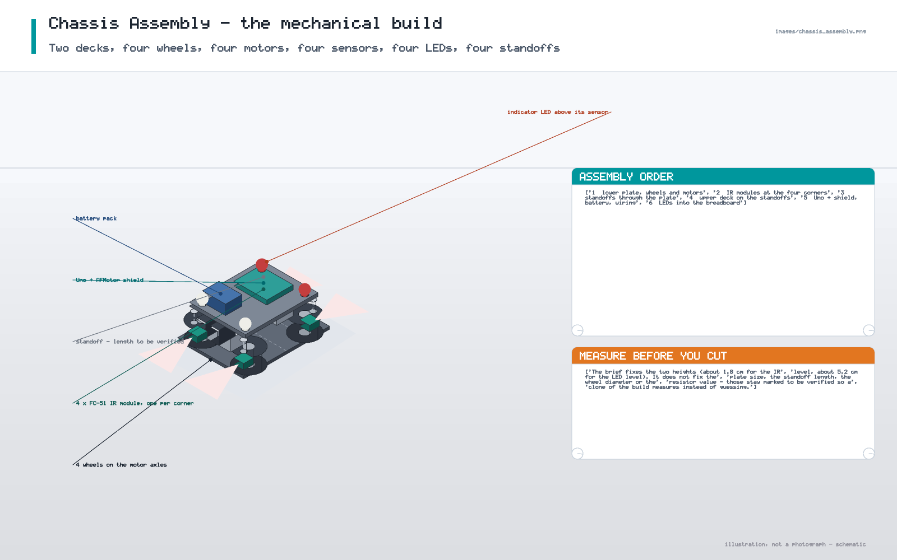

# 06 — Mechanical Construction

The build, in the order it was actually done. Fourteen steps, plus the practical
notes that cost time on this project.

---

## 1. Chassis preparation

1. Cut or choose the two chassis plates. **Plate dimensions are to be verified** —
   the brief does not fix them; the drawings are schematic.
2. Mark the centre line of the lower plate and the four mounting points for the
   motors. Keep the front wider than the rear so the robot is stable.
3. Drill the motor mounting holes and the standoff holes. Deburr every hole; a
   burr will cut the wire insulation later.
4. Mark the four corner positions for the IR modules, one per corner, pointing
   outwards.

## 2. Mounting the four motors

5. Screw the four geared DC motors to the **lower** plate, two per side, with
   their shafts pointing outwards.
6. Check that the gearbox housings do not touch each other or the plate edge.
7. Leave enough clearance above each motor for the wheel.

## 3. Mounting the wheels

8. Press each wheel onto its motor shaft. **Secure it** — a press fit alone came
   loose in testing; the final build uses a grub screw or a locking collar
   wherever the motor allows one.
9. Do the same for the opposite side, and check that all four wheels turn freely
   by hand.

## 4. Wheel alignment and mechanical stability

10. Place the chassis on a flat surface and push it in a straight line. It must
    track straight without binding or rubbing:
    * if it veers, one wheel is not perpendicular or one motor is binding;
    * if it scrapes, the axle is not square to the plate.
11. Lift one wheel off the ground and spin it by hand — it must coast freely. A
    motor that feels rough wastes battery power and slows the robot down.

## 5. Creating the two chassis levels

12. Fit four standoffs (**length to be verified**) and bolt the **upper** plate on
    top. The lower level carries the IR sensors; the upper level carries the
    LEDs.
13. The brief's approximate heights are ≈ 1.8 cm for the lower sensor level and
    ≈ 5.2 cm for the upper level. Measure yours and write the real numbers into
    this file — that is what "to be verified" means.

## 6. Installing the four IR sensors on the lower level

14. Mount one FC-51 at each corner of the lower plate, at the lower level, with
    the emitter/detector pair facing outwards from the chassis.
15. Set each trimpot to mid-range before wiring anything, then tune with the
    actual obstacle and the actual floor material.
16. Fix the modules so they cannot tilt; a tilted IR module changes its range
    dramatically.
17. Route the sensor cables along the plate, away from the motor cables.

## 7. Installing the four LEDs above them

18. Mount each LED so it sits **directly above** its own sensor: the front-left
    LED above the front-left FC-51, and so on. That way the indicator always
    belongs to the sensor that triggered it.
19. 2 red at the front, 2 white at the rear, all on the upper level.
20. Leave enough lead length to reach the breadboard; extend with soldered,
    heat-shrunk joints if needed.

## 8. Soldering the motor wires

21. Solder a red and a black wire to each motor's two terminals.
22. Inspect every joint: a good joint is shiny, smooth and cone-shaped. A dull,
    ball-shaped or wobbly joint is a future break.
23. Insulate each joint individually. Do not rely on the wire colour alone —
    a motor terminal has no inherent polarity.

## 9. Connecting the motors to M1–M4

24. Connect the motors to the shield with the left/right mirror described in
    [05 Wiring §4](05_Wiring.md#4-motor-wiring-and-the-leftright-mirror):
    * M1 = front left, M2 = back left, M3 = back right, M4 = front right.
25. This is the step that was wrong first time. The record is in
    [history/motor_testing.md](../history/motor_testing.md).

## 10. Connecting the LEDs through current-limiting resistors

26. Seat one resistor per LED in the breadboard.
27. Wire `pin → resistor → LED anode`, and `LED cathode → GND`.
28. The resistor may equally sit between the LED and ground; it is a series
    element either way. See [05 Wiring §3](05_Wiring.md#3-leds-anode-cathode-and-where-the-resistor-goes).
29. Resistor value **to be verified** — see the calculation in
    [05 Wiring §3](05_Wiring.md#3-leds-anode-cathode-and-where-the-resistor-goes).

## 11. Connecting the IR sensors

30. VCC → 5 V, GND → common ground, OUT → `A2`/`A3`/`A4`/`A5` respectively.
31. Double-check the corner-to-pin order against the table in
    [05 Wiring §2](05_Wiring.md#2-sensors-the-four-ir-inputs); a swapped pair of
    rear sensors produces a robot that reacts to the wrong side.

## 12. Power wiring

32. Battery `+` → shield `VIN`; battery `−` → common ground.
33. The Uno gets its logic supply through the shield stack, or over USB while
    being programmed.
34. Never connect the 7.4 V pack to the 5 V pin.

## 13. Cable management

35. Tie the motor cables to the chassis edge so they cannot reach a wheel or a
    belt.
36. Keep sensor and LED wiring on the opposite side, and keep it away from the
    motor return path.
37. Strain-relieve every soldered joint: a light tie or a bead of hot glue where
    the wire leaves the joint.
38. Re-check that no bare conductor is visible anywhere.

## 14. Final inspection before power

39. Continuity/short check between `+` and `GND` with the battery **disconnected**
    and the motors removed from the shield if possible.
40. Confirm the wheel direction test one more time with the robot on blocks.
41. Confirm that no wire can reach a wheel through its full rotation.
42. Then, and only then, power up — with the robot on blocks so it cannot drive
    off the bench.

The full checklist is repeated in
[12 Final Implementation §11](12_Final_Implementation.md#11-safety-checklist-before-powering).

## 15. Practical notes

| Note | Why it matters here |
|---|---|
| **Secure the wheels** | A press fit came loose in testing; the robot then drove in circles and the "wrong direction" fault was misdiagnosed for a while. |
| **Check the solder joints** | Dull or ball-shaped joints are the first thing to fail once the chassis starts vibrating. |
| **No loose motor wires** | A motor lead that touches a wheel will be destroyed immediately and can short the pack. |
| **Avoid shorts** | A stray strand between `+` and ground on a 2S pack is a serious fault, not a nuisance. |
| **Separate motor and signal wiring** | Motor current transients show up on the IR `OUT` lines if they share a cable route; the symptom is phantom obstacles. |
| **Common ground** | Without a single common ground the FC-51 outputs are meaningless relative to the Uno's reference. |
| **Check polarity and orientation** | Verify each motor's direction individually before running all four together. |

## 16. What is still not fixed

| Item | Status |
|---|---|
| Lower sensor level ≈ 1.8 cm | from the brief, approximate — measure |
| Upper level ≈ 5.2 cm | from the brief, approximate — measure |
| Chassis length / width | **to be verified** |
| Deck gap / standoff length | **to be verified** |
| Wheel diameter | **to be verified** |
| LED series resistor value | **to be verified** |
