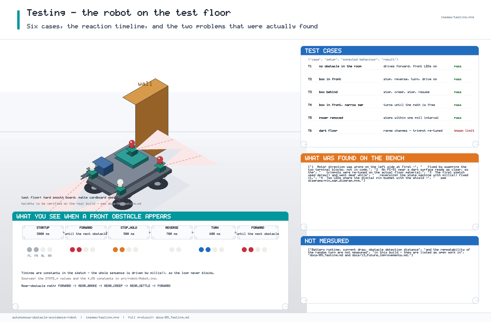
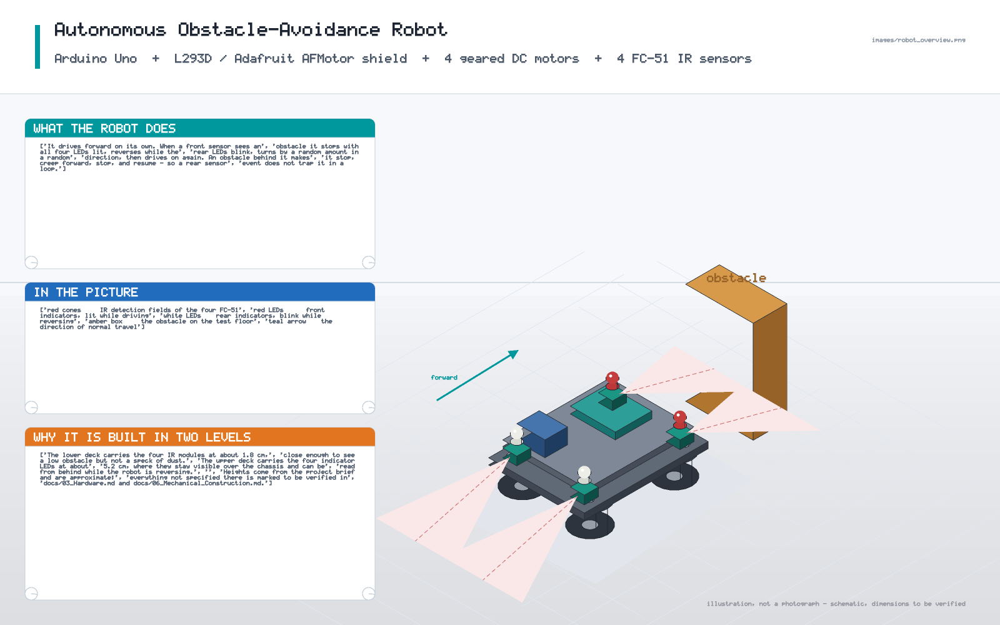

# 09 — Testing

The bench procedure used on the final build, and what it found. Every result
below is an observation from the build; anything that was not measured is listed
as not measured rather than estimated.



---

## 1. Test conditions

| Item | Value |
|---|---|
| Floor | hard, smooth board |
| Obstacle | matte cardboard box |
| Supply | 2 × 18650 in series, 7.4 V nominal |
| Firmware | `src/robot/Robot.ino`, `AFMotor`, Arduino Uno |
| Robot starting state | on blocks, for the first power-up |
| Room | indoor, normal artificial light |

Measurement equipment actually used: a multimeter (supply voltage, continuity).
**No current probe, no oscilloscope and no encoder instrumentation were
available**, which is why current and range figures are marked *to be verified*.

## 2. Order of testing

The order matters: each stage isolates one part of the system.

```
A  continuity and polarity, unpowered
B  power rails, motors still disconnected
C  one motor at a time
D  all four motors together
E  one IR sensor at a time
F  sensors and LEDs together
G  the complete robot on the floor
```

Never skip to G. Two of the three faults found on this project (wrong motor
direction, rear motors not moving) were invisible until stage C/D, and would
have been misread as a software bug at stage G.

## 3. Stage A — continuity, unpowered

| Step | Action | Expected |
|---|---|---|
| A1 | Battery disconnected. Measure between shield `VIN` and `GND`. | No continuity (open circuit). |
| A2 | Measure across each motor's two terminals. | Continuity (a motor is a coil, not a short). |
| A3 | Measure from every LED cathode to the GND rail. | Continuity. |
| A4 | Look for a loose strand anywhere near a motor terminal. | None. |

**Observation:** the first build had a stray strand of red wire touching a motor
terminal. It was found at A4 and removed before the first power-up.

**Lesson:** a short between `VIN` and `GND` on a 2S pack is a serious fault;
fifteen seconds of inspection is worth it.

## 4. Stage B — power rails

| Step | Action | Expected |
|---|---|---|
| B1 | Power the pack into the shield with all motors removed. | Shield powers up, no smoke, no smell. |
| B2 | Measure `VIN` to `GND`. | 7.4 V nominal, **to be verified** on a meter — a fresh 2S 18650 pack is ≈ 8.4 V when full and ≈ 6.0 V when empty. |
| B3 | Measure the Uno 5 V pin. | ≈ 5 V. |
| B4 | Measure the voltage at each FC-51 `VCC` with a module attached. | ≈ 5 V at every module, not just at the first. |

**Observation:** the motor rail sagged visibly when the motors were reconnected
and drove; the logic rail did not. This is the expected division of labour and
confirms that the motors are not being supplied through the Uno regulator.

## 5. Stage C — one motor at a time

| Step | Action | Expected |
|---|---|---|
| C1 | Lift the robot onto blocks so no wheel touches the floor. | Wheels free. |
| C2 | `motor.run(FORWARD)` on M1 only. | M1 spins forward. |
| C3 | `motor.run(FORWARD)` on M2 only. | M2 spins forward. |
| C4 | `motor.run(FORWARD)` on M3 only. | M3 spins forward. |
| C5 | `motor.run(FORWARD)` on M4 only. | M4 spins forward. |
| C6 | Repeat all four with `run(BACKWARD)`. | Each motor reverses. |
| C7 | `run(RELEASE)` on each. | Each motor coasts to a stop. |

**Observation:** M3 and M4 ran backwards on the first attempt while M1 and M2
ran forwards. The cause and the fix are in
[10 Troubleshooting §1](10_Troubleshooting.md#1-front-motors-move-in-the-opposite-direction)
and in [05 Wiring §4](05_Wiring.md#4-motor-wiring-and-the-leftright-mirror):
the left/right terminal mirror was missing. The fix was to swap the two
terminals at the shield, **not** to invert the direction in code.

**A motor that spins freely on the bench can still fail to start on the floor.**
That is the load case, and it is stage D.

## 6. Stage D — all four motors together

| Step | Action | Expected |
|---|---|---|
| D1 | On blocks: `run(FORWARD)` on all four channels. | All four spin the same way. |
| D2 | On the floor: same command. | The robot drives forward in a straight line. |
| D3 | On the floor: `run(BACKWARD)` on all four. | The robot drives backwards in a straight line. |
| D4 | `run(RELEASE)` on all four. | The robot stops. |
| D5 | Repeat D1–D4 on a carpeted surface. | Slower but still moving; no stall. |

**Observations on this build:**

* Rear motors occasionally did not start from a standstill on the battery used
  at the time, while the front pair did. This was a **supply** symptom, not a
  wiring symptom: the same command worked when the robot was pushed forward
  first. See [11 Power System](11_Power_System.md#3-why-a-motor-robot-needs-a-strong-source)
  and [history/power_testing.md](../history/power_testing.md).
* The robot pulled to one side on the carpet. The cause was one wheel with more
  rolling resistance, not a motor fault.

## 7. Stage E — one IR sensor at a time

### Step 1 — power and idle level

| Action | Expected |
|---|---|
| Power the robot, place a hand in front of one module. | The `OUT` line changes level. |
| Measure `OUT` with nothing in range. | Record the level. |
| Measure `OUT` with an obstacle at ≈ 10 cm. | Record the level. |

### Step 2 — range

Move a cardboard box away from the sensor in 5 cm steps and note where the
`OUT` level changes. **Result: to be verified** for the real floor material;
the module's own trimpot sets it.

### Step 3 — per-sensor check

For each of the four modules: cover the emitter with a finger, then with a piece
of white paper, then remove it. Record which of the three changes the level.

### Step 4 — LOW/HIGH sensor logic

**This is the important one for this project.**

```
A digitalRead() of the FC-51 OUT pin must be interpreted the right way round.
The standard LM393 module pulls OUT LOW while an obstacle is in range.
That is what the sketch assumes:

    #define SENSOR_ACTIVE_LOW  1
    ...
    return level == LOW;          // obstacle present
```

Procedure:

1. Upload the sketch.
2. Open the Serial Monitor at 9600 baud and add a temporary
   `Serial.println(obstacleFrontLeft);` in the `FORWARD` case.
3. Hold an obstacle in front of the front-left module. The printed value must go
   to `1` when the obstacle appears, not to `0`.
4. If it does the opposite, **your module reports HIGH for "obstacle"**. Set
   `#define SENSOR_ACTIVE_LOW 0` — that is the only change needed. Do not
       "fix" it by editing four different functions.

**Observation on this build:** `SENSOR_ACTIVE_LOW = 1` was correct, and the
behaviour matched the datasheet description of the module.

## 8. Stage F — sensors and LEDs together

| Step | Action | Expected |
|---|---|---|
| F1 | All LEDs off at power-up, then blinking for 3 s. | Startup indication. |
| F2 | After 3 s the robot starts driving and the front pair stays on. | Normal forward. |
| F3 | Block the front-left sensor. | The robot stops within ~50 ms, all four LEDs on. |
| F4 | Release it. | The sequence continues: reverse, rear pair blinking. |
| F5 | Watch the turn. | One side's pair blinks; the turn direction matches it. |
| F6 | Block the rear-left sensor. | Stop → forward creep → stop → resume. |
| F7 | Block both front sensors. | Same as F3 (OR logic). |
| F8 | Block front and rear at once. | The front sequence wins. |

## 9. Stage G — the complete robot



| # | Case | Setup | Expected | Result |
|---|---|---|---|---|
| T1 | clear floor | no obstacles | drives forward, front LEDs on | pass |
| T2 | obstacle in front | box at 15 cm | stop → reverse → turn → resume | pass |
| T3 | obstacle behind | box at 15 cm | stop → creep → stop → resume | pass |
| T4 | narrow gap | two boxes forming a 25 cm gap | turns until the path is free | pass |
| T5 | power removed | disconnect the pack while driving | stops within one poll interval | pass |
| T6 | dark floor | low ambient light | detection range changes | **known limit** |
| T7 | obstacle appears during the reverse | box moved in behind during `REVERSE` | not re-evaluated until `FORWARD` | **known limit**, see [08 §7](08_Algorithm.md#7-why-the-sensor-read-is-inside-the-forward-case) |
| T8 | glossy floor | polished board | specular reflection can give a false trigger | **known limit** |

T6, T7 and T8 are listed as limits rather than failures because the final design
does not claim to handle them. They are the motivation for
[13 Future Improvements](13_Future_Improvements.md).

## 10. What was **not** measured

| Item | Why |
|---|---|
| Battery runtime | no current measurement was available |
| Average and peak current | no current probe |
| Motor startup / stall current | not taken from a datasheet, not measured |
| Obstacle detection distance per surface | not characterised beyond a single cardboard box |
| Turn-angle repeatability | the turn is a fixed 600 ms, not an angle, so it was not characterised |
| Maximum speed on the floor | not measured |

These are honest gaps, listed in
[13 Future Improvements](13_Future_Improvements.md) rather than filled with
guesses.

## 11. Reproducing the tests

1. Build the hardware as described in
   [06 Mechanical Construction](06_Mechanical_Construction.md) and
   [05 Wiring](05_Wiring.md).
2. Upload the firmware — see
   [12 Final Implementation §9](12_Final_Implementation.md#9-compile-and-upload--arduino-ide-1819).
3. Run stages A → G in order. Do not skip a stage.
4. Keep the robot on blocks until stage D has passed.
5. Record the results next to the table above, replacing the *to be verified*
   entries with your own measurements.
